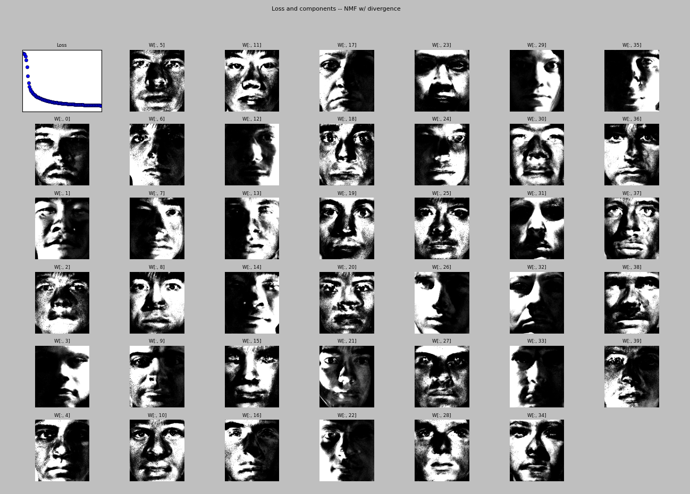
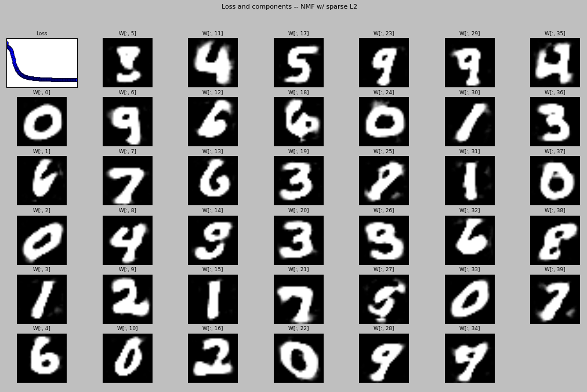
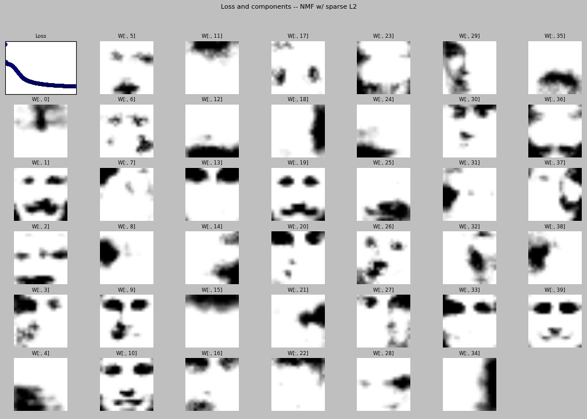

NMFViz
======

This simple program proposes a visualization of what happens while training a NMF as in :

* *Algorithms for non-negative matrix factorization* from Lee & Seung
[(NIPS 2011)](http://papers.nips.cc/paper/1861-algorithms-for-non-negative-matrix-factorization.pdf).
* *Non-negative sparse coding* from Hoyer [(arXiv)](http://arxiv.org/pdf/cs/0202009.pdf)

It supports the following datasets:

* [Extended Yale B dataset](http://vision.ucsd.edu/~leekc/ExtYaleDatabase/ExtYaleB.html)
* [MNIST](http://yann.lecun.com/exdb/mnist/)
* [CBCL](http://cbcl.mit.edu/cbcl/software-datasets/FaceData2.html)

It works for me (tm) on OSX with Python 3.4.3 and these libraries:

* matplotlib==1.4.3
* numpy==1.9.2
* simplejson==3.8.0

Please do contact me if you have any trouble using this tool.

How-to
------

1. Fetch some data to play with:
	1. Use the get_yale.sh bash script to get the data, put them all in the same folder (and remove *Ambient.pgm files*)
	1. Use the get_mnist.sh bash script to get the MNSIT data (gunzip binary file)
1. Use the nmf_viz.py python script to visualize the training procedure.

### Parameters of viz.py
The python script viz.py reads its configuration from the conf.json file. Parameters are :

1. data = Information on the data
		1. type: type of dataset. For now: 'Cropped Yale' or 'MNSIT'
    1. path: The path to the directory storing all images (CroppedYale/ if you successfully used the get_yale.sh script)
    1. number: Number of images to use (they are 2409 that are successfully loaded by the script from cropped Yale)
1. nmf = Describes the NMF with:
    1. type: the name of the loss to use ("euclidean" or "divergence" or "sparse" or "sparse-l2")
    1. components: the number of components to use
    1. iterations: the number of training iterations
    1. sparseness: the weight of the sparseness constraint, if any in the model.
    1. learning rate: the learning rate, if any in the model.
    1. learning rate decay: the learning rate decay, if any in the model.
    1. l2: the weight of the L2 regularization, if any in the model

Screenshot
------

Here is a screenshot of the 'divergence' NMF with 40 components and 100 iterations on 100 'Cropped Yale' images.

Here is another screenshot of the 'sparse-L2' NMF with 40 components, 150 iterations on 10000 'MNSIT' images.

Here is another screenshot of the 'sparse-L2' NMF with 40 components, 150 iterations on 6000 'CBCL' images.

